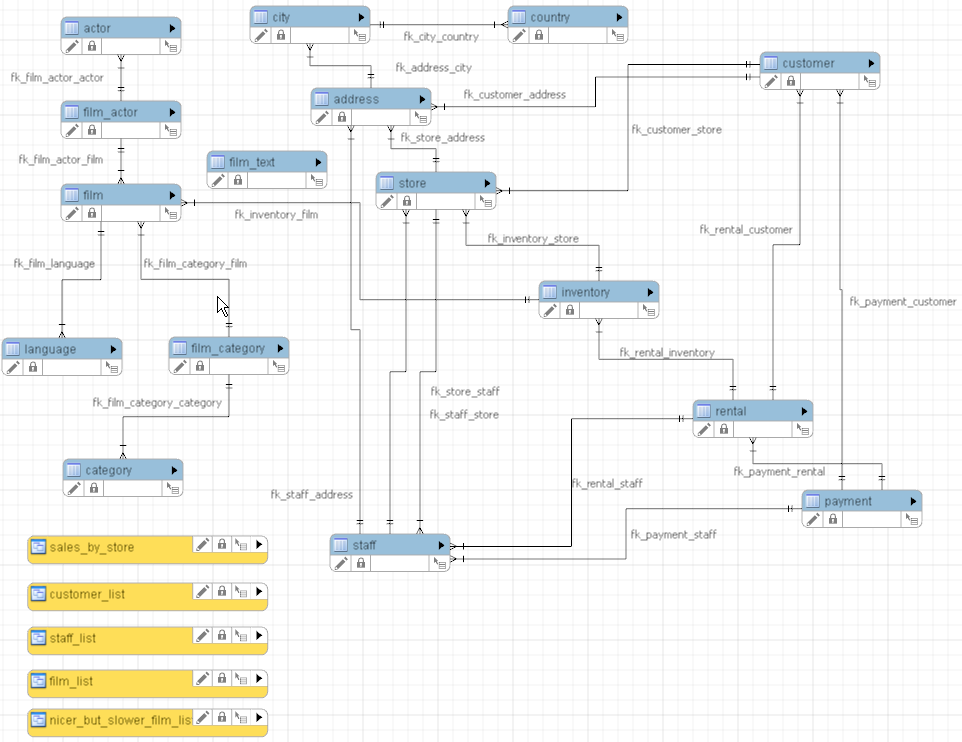

# Case Video Club.

Descargar el script de la bases de datos, y transformarlo para que funciones en PostgreSQL.
[https://dev.mysql.com/doc/sakila/en/sakila-installation.html](https://dev.mysql.com/doc/sakila/en/sakila-installation.html)

Diagrama de la base de datos

disponible en:
[https://dev.mysql.com/doc/sakila/en/sakila-structure.html](https://dev.mysql.com/doc/sakila/en/sakila-structure.html)

>## Consultas iniciales

1. Obtener el nombre, idioma original de la película, fecha de alquiler y fecha de devolución de todos los alquileres realizados por el cliente: Nombre: BARBARA Apellido: JONES (22 Filas)     
2. Mostrar Apellido, Nombre de los actores que participan en todas las películas de la categoría Comedy con y sin repetición (286 filas c/repetición) (147 filas s/repetición) [DISTINCT]
3. Obtener todos los datos de película en las que participo el actor de nombre : RAY  (30 filas)
4. Obtener un listado de todas las películas cuya duración sea entre 61 y 99 minutos (ambos inclusive) y el lenguaje original sea French (9 rows)
5. Mostrar nombre ciudad y nombre de país (en MAYÚSCULAS) de todas las ciudades de los países (Austria, Chile, France) ordenadas por país luego nombre localidad (10 filas) [UPPER]
6. Mostrar el apellido (minúsculas) concatenado al nombre (MAYÚSCULAS) cuyo apellido de los actores contenga SS. (7 Filas) [LIKE, UPPER, LOWER]
7. Mostrar el nro de ejemplar y nombre película de todos los alquileres del día 26 (sin importar mes) que sean del almacén de la ciudad Woodridge (99 filas) [Utilizando extract o date_part]
8. Mostrar la segunda pagina (cada una tiene 10 películas) del listado nombre de la película , lenguaje original y valor de reposición de la películas ordenadas por su valor de reposición del mas caro al mas barato (10 filas) [LIMIT, OFFSET y ORDER]
9. Mostrar el nombre de la película, el nombre del cliente, nro de ejemplar, fecha de alquiler, fecha de devolución de los ejemplares que demoraron mas de 7 días en ser devueltos (3557 filas) [AGE]

>## Consultas intermedias.
10.  Mostrar todas las películas que están alquiladas y que todavía no fueron devueltas. Mostrando el nombre de la película, el número de ejemplar, quien la alquilo y la fecha. Mostrar el nombre del cliente de la manera Apellido, Nombre y renombre el campo como 'nombre_cliente' 
11. Mostrar cuales fueron las 10 películas mas alquiladas 
12. Realizar un listado de las películas que fueron alquiladas por el cliente "OWENS, CARMEN" 
13. Buscar los pagos que no han sido asignados a ningún alquiler 
14. Seleccionar todas las películas que son en "Mandarin" y listar las por orden alfabético. Mostrando el titulo de la película y el idioma ingresando el idioma en minúsculas. 
15. Mostrar los clientes que hayan alquilado mas de 1 vez la misma película 
16. Mostrar los totales de alquileres por mes del año 2005 
17. Mostrar los totales históricos de alquileres discriminados por categoría. Ordene los resultados por el campo monto en orden descendente al campo calculado llamarlo monto. 
18. Listar todos los actores de las películas alquiladas en el periodo 7 del año 2005. Ordenados alfabéticamente representados "APELLIDO, nombre" renombrar el campo como Actor 
19. Listar el monto gastado por el customer last_name=SHAW; first_name=CLARA; 
20. Listar el valor mas alto de los alquileres registrados en el año 2005. Mostrar además quien fue el cliente que abono ese alquiler. 
21. Listar el monto gastado por los customer que hayan gastado mas de 40 en el mes 6 de 2005. 
22. Mostrar la cantidad del clientes hay por ciudad 
23. Mostrar las 5 películas con mayor cantidad de actores. 
24. Mostrar los días donde se hayan alquilado mas de 10 de películas de "Drama" 
25. Mostrar los actores que no están en ninguna película 

>## Consultas avanzadas.
26. Mostrar los clientes que hayan alquilado la película mas alquilada conjuntamente con los clientes que hayan alquilado la menos alquilada con repeticiones, ordenados alfabéticamente 
27. Mostrar los clientes que hayan alquilado la película mas alquilada conjuntamente con los clientes que hayan alquilado la menos alquilada sin repeticiones, ordenados alfabéticamente 
28. Mostrar el/los clientes que hayan alquilo la película mas alquilada y la menos alquilada. 
29. Mostrar los clientes que alquilaron películas de la categoría 'New' los días en que se hayan alquilado más de 40 ejemplares de dicha categoría 
30. Mostrar los días que se hayan alquilado películas (cantidad) por encima de la media de alquileres diaria ordenado por la cantidad de alquileres.